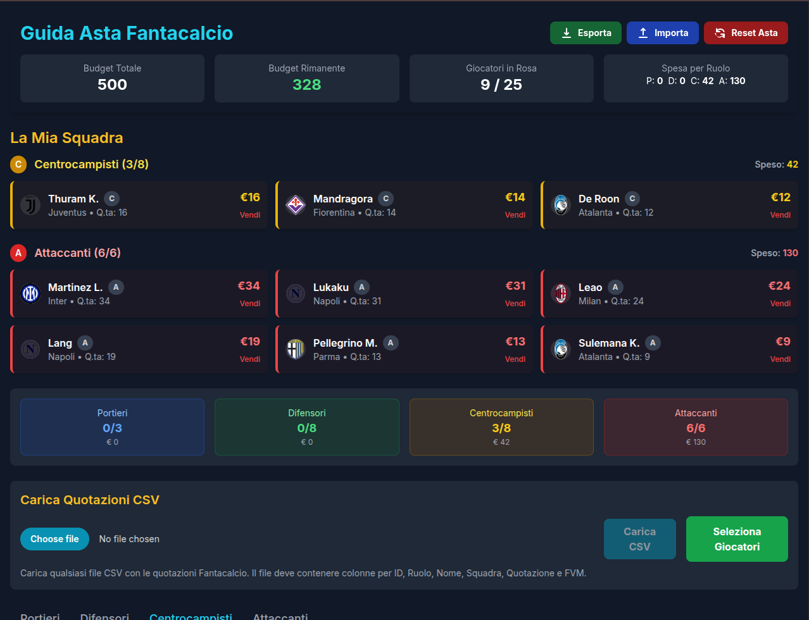
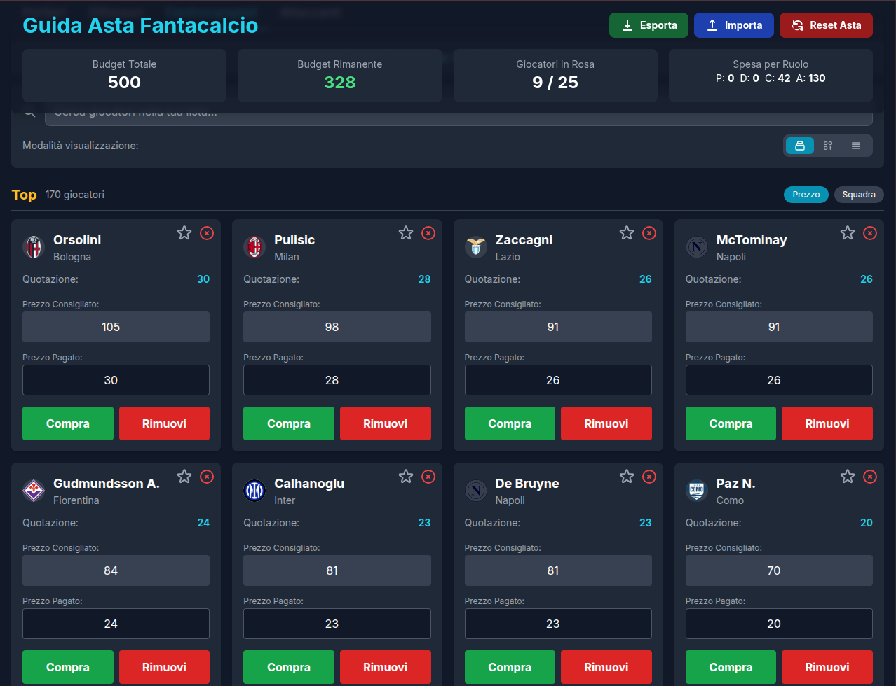

# 🏆 Fanta Asta Tool

[](https://opensource.org/licenses/Apache-2.0)
[](#)
[](#)
[](#)
[](#)

Un **tool web interattivo** per gestire le aste del Fantacalcio 2026/27. Ottimizzato per desktop e mobile, ti aiuta a organizzare la tua asta con un'interfaccia moderna e funzionalità avanzate.





## ✨ Caratteristiche Principali

### 🎯 **Gestione Asta Completa**
- **Importazione XLSX/CSV**: Carica il listone ufficiale Fantacalcio 2026/27 (.xlsx o .csv)
- **Ricerca Intelligente**: Filtra per nome, ruolo, squadra e tier
- **Selezione Multipla**: Aggiungi più giocatori contemporaneamente
- **Prezzi Suggeriti**: Calcolo automatico prezzi consigliati per tier

### 💎 **Sistema Favoriti**
- **Wishlist Personalizzata**: Contrassegna i tuoi giocatori preferiti con la stella ⭐
- **Bordi Colorati**: Identificazione visiva immediata (dorato per favoriti, verde per acquistati, rosso per rimossi)
- **Priorità Visuale**: Sistema di bordi con priorità per stato del giocatore

### 📱 **Esperienza Mobile-First**
- **Design Responsive**: Ottimizzato per smartphone, tablet e desktop
- **Touch Targets**: Pulsanti dimensionati per il tocco (minimum 44px)
- **Layout Adattivo**: 3 modalità di visualizzazione (Grande, Piccola, Lista)
- **Gesture Friendly**: Input ottimizzati per dispositivi touch

### 📊 **Monitoraggio Budget**
- **Budget Tracker**: Visualizzazione in tempo reale del budget rimanente
- **Spesa per Ruolo**: Breakdown dettagliato P/D/C/A
- **Limiti Rosa**: Controllo automatico limiti 25 giocatori per ruolo
- **Calcoli Automatici**: Aggiornamento istantaneo di tutte le statistiche

### 💾 **Persistenza Dati**
- **AutoSave**: Salvataggio automatico su localStorage
- **Import/Export**: Backup e ripristino configurazioni asta
- **Stato Completo**: Mantiene favoriti, rimozioni e acquisti tra sessioni

## 🚀 Come Iniziare

### Metodo 1: GitHub Pages (Consigliato)
```bash
# Apri direttamente nel browser
https://fraporta.github.io/fanta_asta_tool/
```

### Metodo 2: Download Locale
```bash
# Clona la repository
git clone https://github.com/FraPorta/fanta_asta_tool.git

# Entra nella cartella
cd fanta_asta_tool

# Apri il file index.html nel browser
open index.html  # macOS
start index.html # Windows
xdg-open index.html # Linux
```

> ℹ️ Se il browser blocca il caricamento degli script locali, usa il Metodo 3 (server locale).

### Metodo 3: Server Locale
```bash
# Con Python 3
python -m http.server 8000

# Con Node.js
npx serve .

# Visita http://localhost:8000
```

## 📖 Guida all'Uso

### 1️⃣ **Importazione Giocatori**
1. Clicca **"Seleziona Giocatori"** per aprire il selettore del listone
2. Usa i filtri per trovare i giocatori desiderati
3. Seleziona i checkbox e clicca **"Aggiungi Selezionati"**
4. Scegli il tier appropriato (Top/Buoni/Scommesse)

### 2️⃣ **Gestione Durante l'Asta**
- **⭐ Favoriti**: Clicca la stella per aggiungere alla wishlist
- **💰 Acquisto**: Inserisci il prezzo e clicca "Compra"
- **🙈 Nascondi**: Usa "Rimuovi" per nascondere giocatori non interessanti
- **🗑️ Elimina**: Pulsante X per rimuovere definitivamente

### 3️⃣ **Visualizzazioni**
- **🔍 Grande**: Card dettagliate con tutte le info
- **📱 Piccola**: Card compatte per overview rapida
- **📋 Lista**: Vista tabulare ottimizzata per mobile

### 4️⃣ **Backup e Ripristino**
- **📤 Esporta**: Salva configurazione corrente in JSON
- **📥 Importa**: Ripristina da file di backup precedente
- **🔄 Reset**: Pulisci tutto e ricomincia

## 🛠️ Tecnologie Utilizzate

| Tecnologia          | Versione | Scopo                         |
| ------------------- | -------- | ----------------------------- |
| **HTML5**           | -        | Struttura semantica           |
| **CSS3**            | -        | Styling avanzato e animazioni |
| **JavaScript ES6+** | -        | Logica applicativa            |
| **Tailwind CSS**    | 3.4.16   | Framework CSS utility-first (in locale) |
| **SheetJS**         | 0.20.3   | Lettura listone .xlsx / .csv (in locale) |
| **Web APIs**        | -        | localStorage, File API        |

## 📂 Struttura del Progetto

```
fanta_asta_tool/
├── 📄 index.html              # Markup della SPA
├── 📁 js/
│   ├── parser.js              # Lettura listone .xlsx/.csv (nessuna dipendenza dal DOM)
│   └── app.js                 # Stato, rendering, persistenza
├── 📁 test/
│   └── parser.test.js         # Test del parser: `node test/parser.test.js`
├── 📁 resources/
│   ├── tailwind.min.js        # Tailwind (copia locale)
│   ├── xlsx.mini.min.js       # SheetJS (copia locale)
│   ├── logos/                 # Loghi Serie A 2026/27
│   └── *.png                  # Screenshot del README
├── 📝 README.md
├── ⚖️ LICENSE
└── 🔧 .git/
```

> ℹ️ Il progetto resta senza build step: apri `index.html` con un server statico
> (`python3 -m http.server`) e apri l'indirizzo nel browser.

## ✅ Test

```bash
node test/parser.test.js
```

Copre il parsing del listone: intestazione in posizione variabile, ordine delle colonne,
colonne Mantra da ignorare, celle vuote, accenti, equivalenza xlsx/csv. Se nella cartella
è presente un file `Quotazioni_Fantacalcio_*.xlsx` viene validato anche quello.

## 🎨 Personalizzazione

Il tool supporta diverse personalizzazioni tramite modifica del codice:

### Colori Tema
Tutti i colori dell'interfaccia sono definiti in un unico punto: il blocco di token CSS
in cima a `index.html`. Non ci sono utility Tailwind sparse nel markup da rincorrere:
per personalizzare la palette basta cambiare i valori qui.

```css
:root {
  --bg:            #080d18;
  --surface:       #0f1729;
  --surface-2:     #131d33;
  --border:        #223050;
  --text:          #f8fafc;
  --text-muted:    #8595b0;
  --text-dim:      #5b6b86;

  --primary:       #14b8a6;
  --primary-strong:#0d9488;
  --primary-soft:  #5eead4;
  --bought:        #22c55e;
  --removed:       #f43f5e;
  --accent:        #f59e0b;

  --role-p-bg: #1e3a8a; --role-p-fg: #bfdbfe;
  --role-d-bg: #065f46; --role-d-fg: #a7f3d0;
  --role-c-bg: #78350f; --role-c-fg: #fde68a;
  --role-a-bg: #7f1d1d; --role-a-fg: #fecaca;

  --radius-sm: 10px;
  --radius-md: 14px;
  --radius-lg: 16px;
}
```

### Calcolo Prezzi
```javascript
// Personalizza i moltiplicatori per ruolo e tier
function calculateRecommendedPrice(player, tier) {
    const multipliers = {
        'Top': {
            'P': 2.0,    // Portieri: 2x (es. 7 → 14)
            'D': 2.5,    // Difensori: 2.5x (es. 20 → 50)
            'C': 3.5,    // Centrocampisti: 3.5x (es. 30 → 105)
            'A': 4.5     // Attaccanti: 4.5x (es. 45 → 200)
        },
        'Buoni': {
            'P': 1.5,    // Portieri: 1.5x
            'D': 2.0,    // Difensori: 2x
            'C': 2.5,    // Centrocampisti: 2.5x
            'A': 3.0     // Attaccanti: 3x
        },
        'Scommesse': {
            'P': 1.0,    // Portieri: prezzo base
            'D': 1.2,    // Difensori: 1.2x
            'C': 1.5,    // Centrocampisti: 1.5x
            'A': 2.0     // Attaccanti: 2x
        }
    };
    
    const roleMultiplier = multipliers[tier][player.role] || 1.0;
    return Math.round(player.qta * roleMultiplier);
}
```

## 🐛 Problemi Noti & Soluzioni

### Browser Safari iOS
- **Problema**: Input potrebbero causare zoom automatico
- **Soluzione**: Font-size 16px già implementato

### Modalità Offline
- **Stato**: Tailwind, SheetJS, i loghi delle squadre e il font Inter (pesi 400/500/600/700/800,
  in `resources/fonts/`) sono tutti salvati in locale: nessuna richiesta di rete viene fatta
  a runtime, l'asta funziona interamente offline.

### File Grandi
- **Problema**: Performance su listoni molto grandi (>5MB)
- **Soluzione**: Paginazione in sviluppo

## 🤝 Contribuire

Contributi benvenuti! Per favore:

1. **Fork** del progetto
2. **Branch** per la feature (`git checkout -b feature/AmazingFeature`)
3. **Commit** modifiche (`git commit -m 'Add AmazingFeature'`)
4. **Push** al branch (`git push origin feature/AmazingFeature`)
5. **Pull Request**

### 💡 Idee per Contributi
- [ ] Supporto per più leghe/campionati
- [ ] Statistiche avanzate giocatori
- [ ] Integrazione API esterne
- [ ] Modalità dark/light theme
- [ ] PWA (Progressive Web App)
- [ ] Notifiche push

## 📄 Licenza

Distribuito sotto licenza **Apache 2.0**. Vedi `LICENSE` per maggiori informazioni.

## 👤 Autore

**FraPorta**
- 🐙 GitHub: [@FraPorta](https://github.com/FraPorta)
- 📧 Email: [Contattami](https://github.com/FraPorta)

## 🙏 Ringraziamenti

- [Tailwind CSS](https://tailwindcss.com/) per il framework CSS
- [Heroicons](https://heroicons.com/) per le icone
- Comunità Fantacalcio per feedback e suggerimenti

---

<div align="center">

**[⬆ Torna in cima](#-fanta-asta-tool)**

Made with ❤️ for the Fantacalcio community

[](https://www.fantacalcio.it/)

</div>